# Continuous Integration using Jenkins

*Demonstration of how to enhance the website solution that we implemented on project: "load-balancer-solution-using-apache-step2" by using a free and open source automation server called Jenkins. We will use Jenkins to automate the deployment of source code changes from our GitHub repository to our NFS server. The source code used on this project was retrieved from darey.io.*

- *This project is a continuation of project: "load-balancer-solution-using-apache-step2".*

- *We will continue using "load-balancer-solution-using-apache-step2" EC2 instances to complete this project.*

Instructions on how to launch and connect to your EC2 instance using an SSH client:

https://github.com/Antonio447-cloud/MEAN-stack-angular

    Happy learning!

## Outline

- Enhance the architecture prepared in project: *"load-balancer-solution-with-apache-step2"* by adding a Jenkins server to our set up and configure a job to automatically deploy source code changes from our GitHub repository to our NFS server.

## Automation with Jenkins

On our previous project: "load-balancer-solution-with-apache-step2" we introduced the horizontal scalability concept, which allowed us to add new web servers to our "DevOps Solution Website".

So, we have successfully deployed a set up with 2 web servers and also a load balancer to distribute traffic between them. Now, if it is just 2 or 3 web servers, it is not a big deal to configure them manually. However, imagine that you would need to repeat the same task over and over again adding dozens or even hundreds of servers.

DevOps is about agility, and speedy release of software and web solutions. So, one of the ways to guarantee fast and repeatable deployments is through "Automation" of routine tasks.

In this project we are going to start automating part of our routine tasks with a free and open source automation server called Jenkins:

- Jenkins is one of the most popular CI/CD tools.

- Continuous integration (CI) is a software development strategy that increases the speed of development while ensuring the quality of the code that the  developer teams deploy. 

- Developers continually commit code in small increments (at least daily, or even several times a day), which is then automatically built and tested before it is merged with our shared repository.

- We are going to utilize Jenkins CI capabilities to make sure that every change made to the source code will be automatically updated to our DevOps Solution Website.

## Forking a GitHub Repository

One of the first things you will need to do, is fork the following GitHub repository into yours:

https://github.com/Antonio447-cloud/tooling/tree/master

Once you have forked the repository, your URL should look like this:

`https://github.com/your-username/tooling`

**NOTE**: *Read about Continuous Integration, Continuous Delivery and Continuous Deployment.*

Now, we will proceed to install and configure the Jenkins server.

## Installing and Configuring the Jenkins Server

- First we create an EC2 instance based on Ubuntu Server 20.04 and name it "Jenkins-CI"

- Then we install JDK which stands for "Java Development Kit" (since Jenkins is a Java-based application)

So we run:

`sudo apt update`

`sudo apt install default-jdk-headless -y`

    Copy the following command to your terminal:

    wget -q -O - https://pkg.jenkins.io/debian-stable/jenkins.io.key | sudo apt-key add -
    sudo sh -c 'echo deb https://pkg.jenkins.io/debian-stable binary/ > \
        /etc/apt/sources.list.d/jenkins.list'

`sudo apt update`

`sudo apt-get install jenkins -y`

We make sure Jenkins is up and running:

`sudo systemctl status jenkins`

- By default the Jenkins server uses TCP port 8080. So, we need to open it by creating a new Inbound Rule on our Jenkins' instance Security Groups.

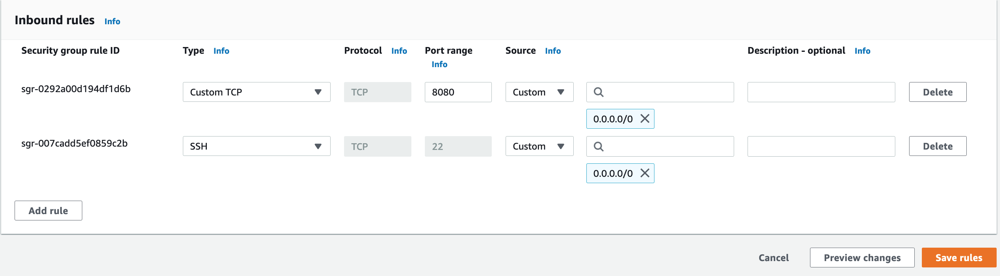

From our browser we access: 

http://Jenkins-Server-Public-IP-Address-or-Public-DNS-Name:8080

- We will be prompted to provide a default admin password.

So we retrieve the password from our Jenkins server:

`sudo cat /var/lib/jenkins/secrets/initialAdminPassword`

Then we paste it:

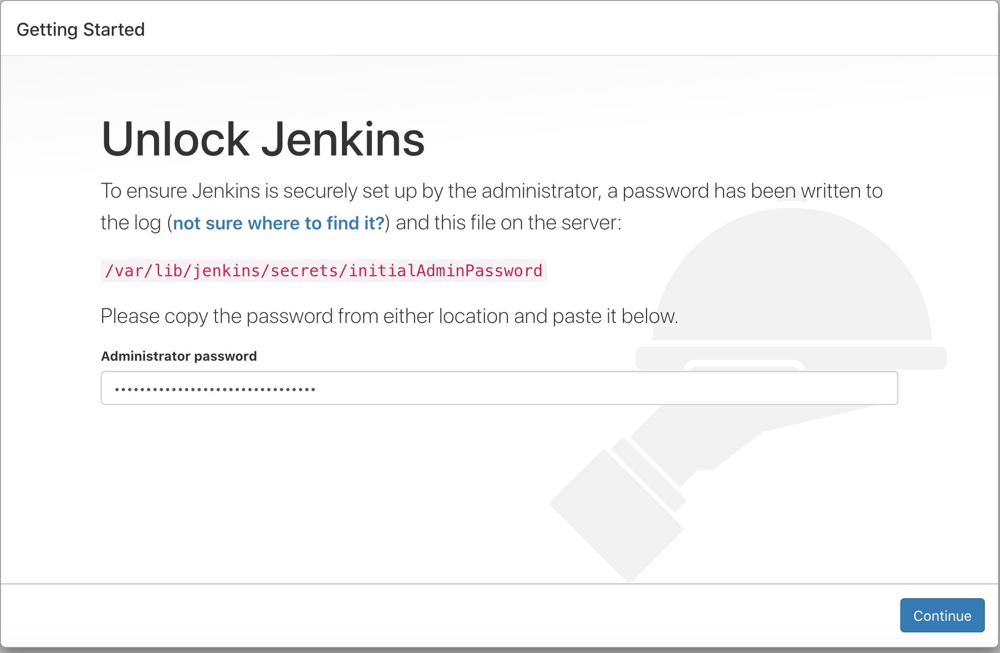

We will be asked which plugins we want to install, so we choose "install suggested Plugins".

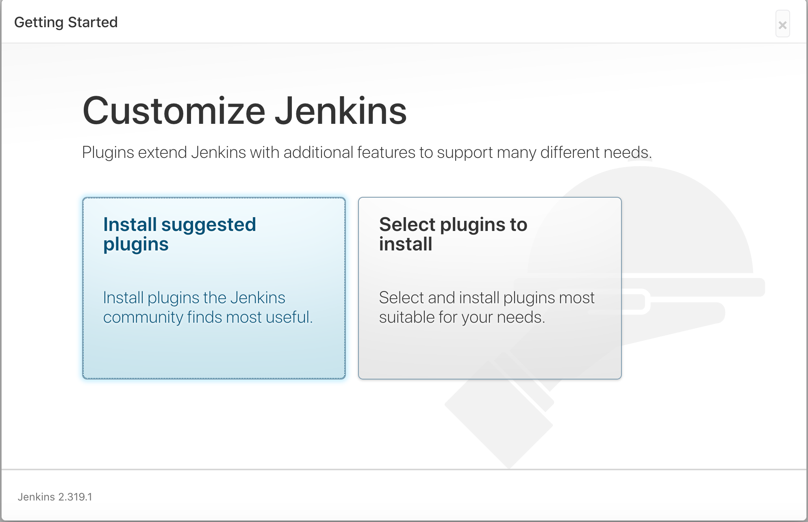

Once the plugins installation is done, we create an admin user.

The installation is completed!

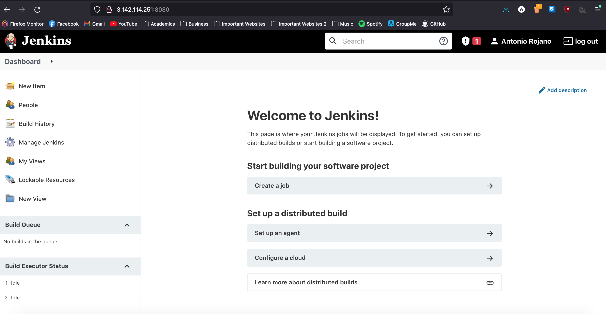

## Configuring Jenkins to Retrieve Source Codes from GitHub using Webhooks

In this part, we will configure a simple Jenkins project. This project will be triggered by GitHub webhooks and will execute a "build" task to retrieve codes from GitHub and store them locally on our Jenkins server.

So we enable webhooks on our GitHub repository settings with http protocol, our Jenkins' instance public IP address, TCP port 8080 and the path we see on the image below:

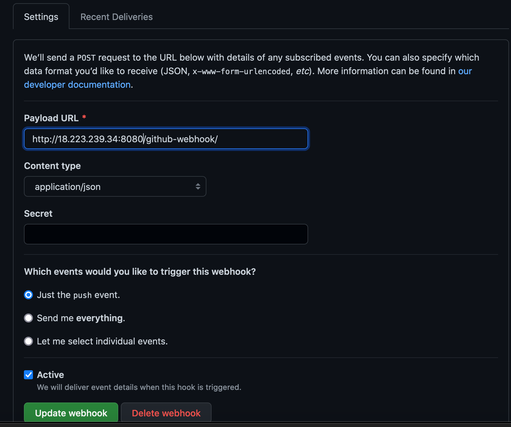

Then we go to our Jenkins web console and click "New Item". Then we create a new "Freestyle project", we can name it what we want, in this case I named it "Project 9":

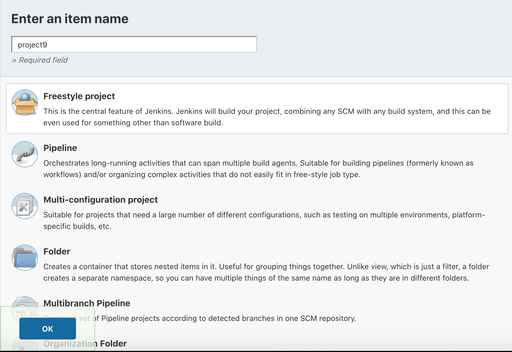

To connect your GitHub repository, you will need to copy the HTTPS URL which you can get from your repository:

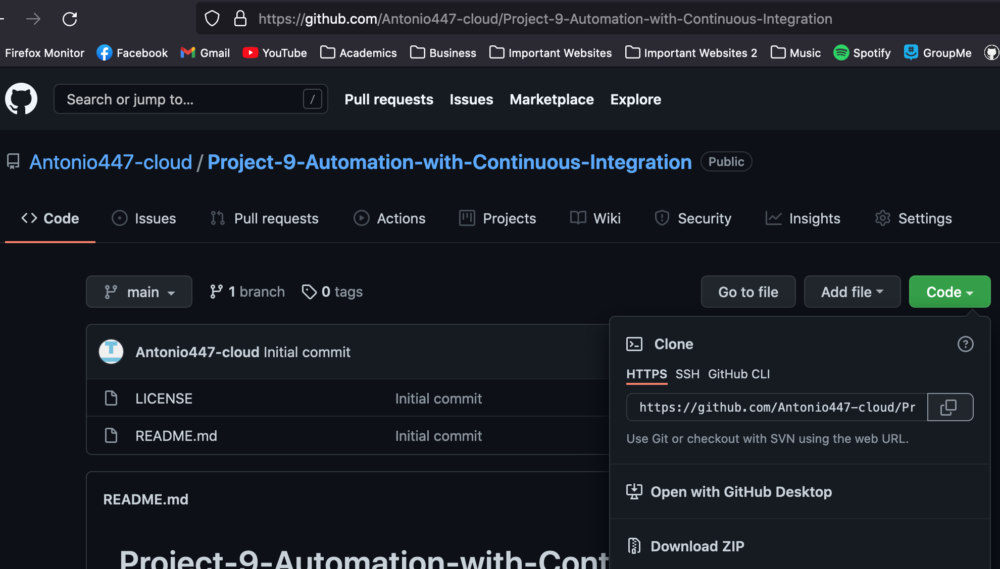

- On the dashboard of our new freestyle project we click on "Configure". 

- Then we go to the "Source Code Management" section and we choose "Git". 

- We paste the HTTPS URL that we copied from our GitHub repository earlier on "Repository URL".

- We provide our GitHub credentials (user/password) so Jenkins can access files in the repository:

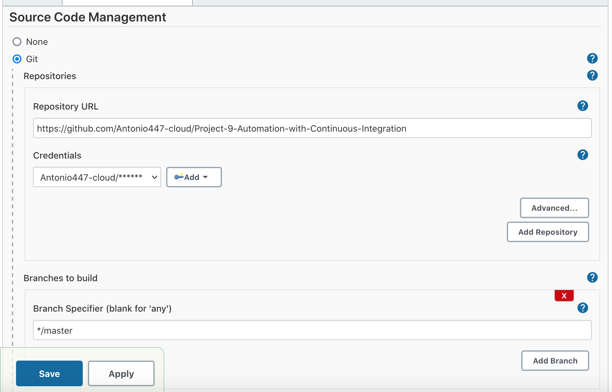

- We save the configuration and run the build. For now we can only do it manually.

- Then we click on the "Build Now" button, if we have configured everything correctly, the build will be successfull and we will see a green checkmark next to #1 right below our "Build History":

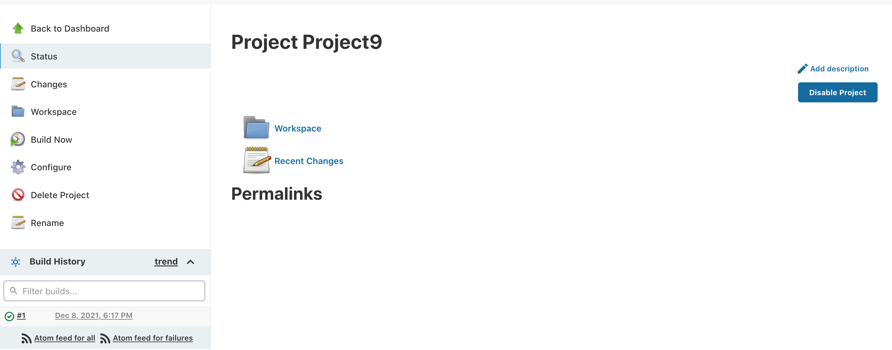

- We click on "Console Output" and see that the build has run successfully. If so, it means that our Jenkins build is working!

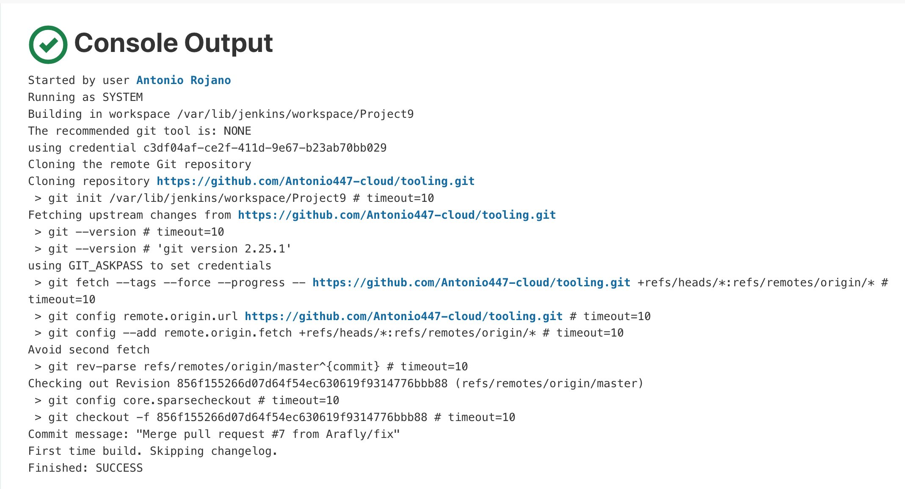

However, this build does not produce anything and it runs only when we trigger it manually. So we need to fix that.

To do so we click on "Configure" on our Jenkins project dashboard and add the following two configurations:

- We trigger the job from GitHub webhook:

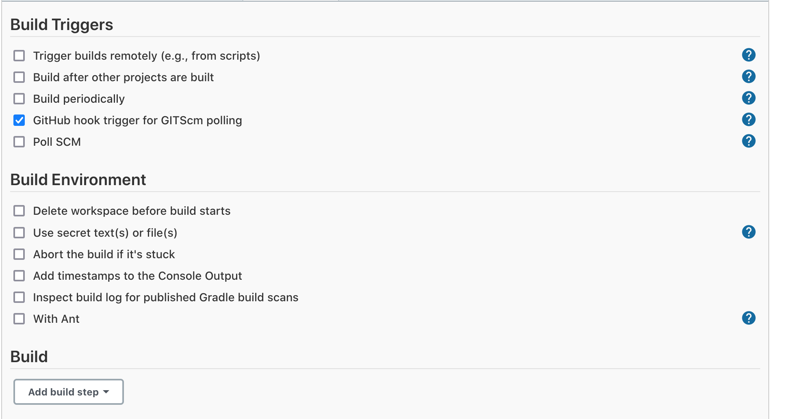

- We configure "Post-build Actions" to archive all the files by typing ** on "Files to archive". (files resulted from a build are called "artifacts)

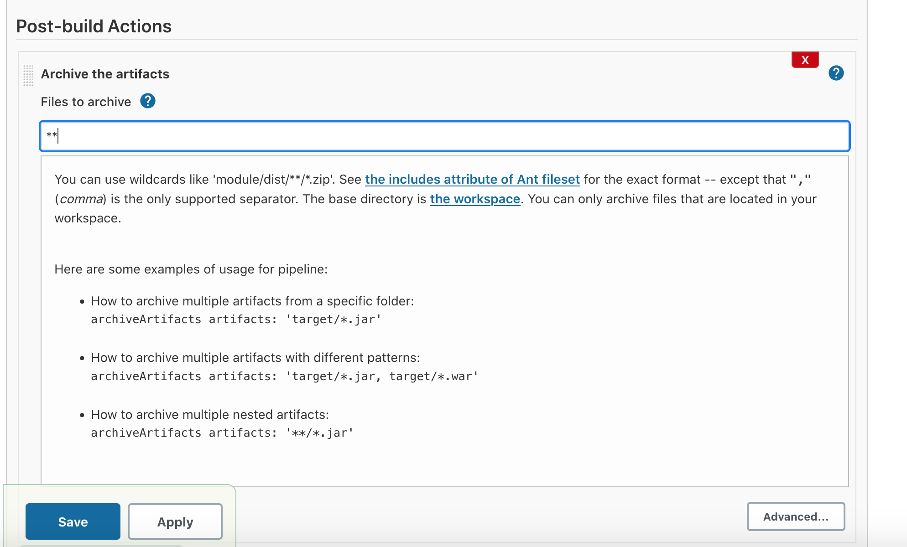

- Now, we make a change in any file of our GitHub repository and push the changes to the master branch. In this case I just added the line 'Checking Jenkins' on my readme.md file and committed the change:

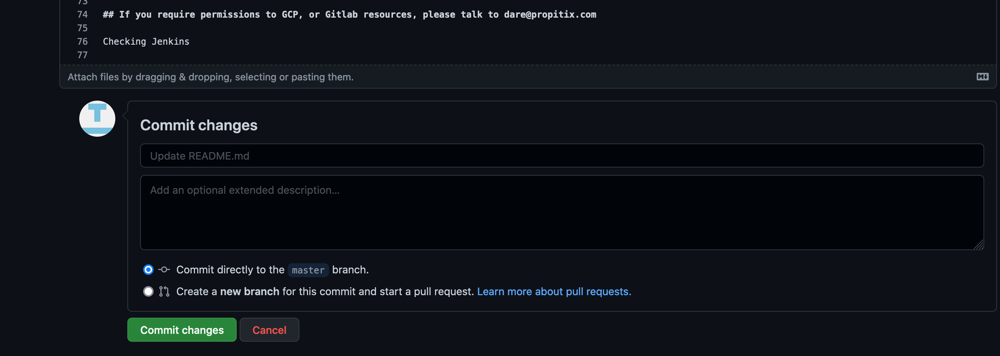

- We can see that a new build has been launched automatically (by webhook) and we can see its results. This new build is "#2" with a green checkmark to the left right below "Build History":

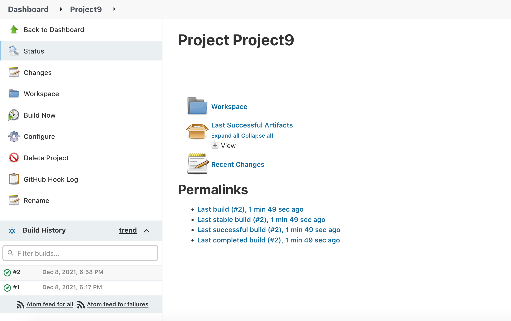

- If we click on "build #2" we can see the artifacts saved on our  Jenkins server.

- We can also see that our Jenkins server tells us which change was made listed under "Changes" on the bottom:

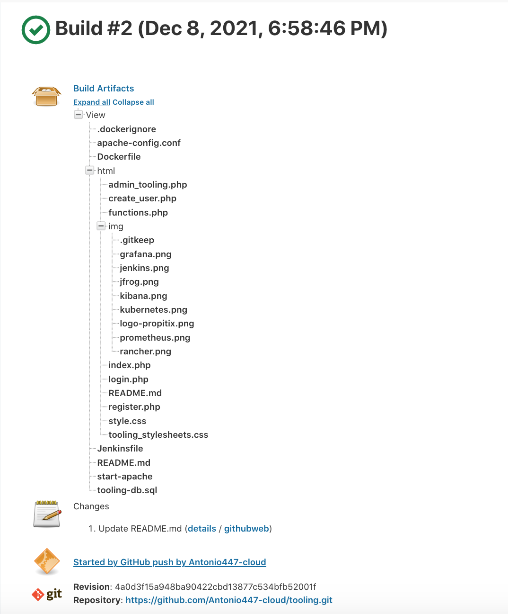

We have now configured an automated Jenkins job that receives files from GitHub by webhook trigger so:

- This method is considered as 'push' because the changes are being 'pushed' and files transfer is initiated by GitHub. 

- There are also other methods. For example triggering one job (downstream) from another (upstream) and polling GitHub, among others.

By default, the artifacts are stored on the Jenkins server locally. Therefore we can list them on our instance:

`sudo ls -l /var/lib/jenkins/jobs/Project9/builds/2/archive`

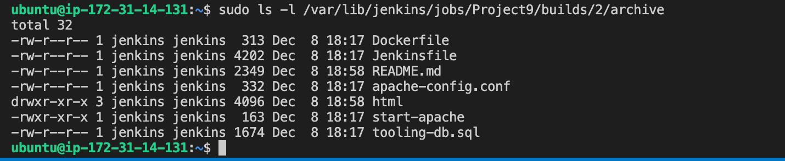

As we can see in the image above, all of our artifacts are there.

Now, we need to configure Jenkins to copy files to the NFS server via SSH.

## Configuring Jenkins to Copy Files to the NFS Server via SSH

Now that we have our artifacts saved locally on our Jenkins server, the next step is to copy these artifacts to our NFS server on the /mnt/apps directory.

Jenkins is a highly extendable application and there are 1400+ plugins available. In our case, we will need a plugin called "Publish Over SSH". So we need to install it:

- In order to do so we go to our main dashboard then click on "Manage Jenkins" and choose "Manage Plugins" menu item.

- Then we click on the "Available" tab and search for "Publish Over SSH" plugin and install it without restart:

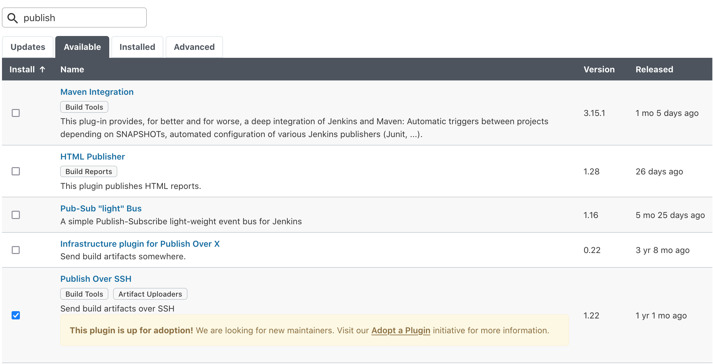
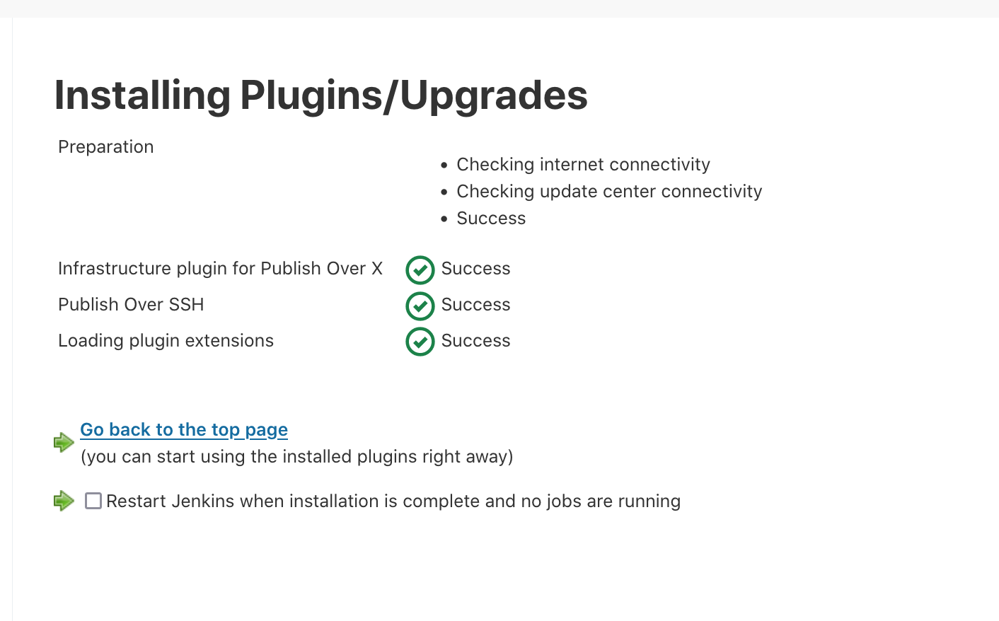

## Configuring your Jenkins Project to Copy Artifacts Over the NFS Server

To configure our Jenkins project to copy artifacts over to the NFS server, we need to go to the main dashboard of our Jenkins server and select "Manage Jenkins" and choose "Configure System".

- Then we scroll down to our Publish Over SSH plugin configuration section and configure it to be able to connect to our NFS server:

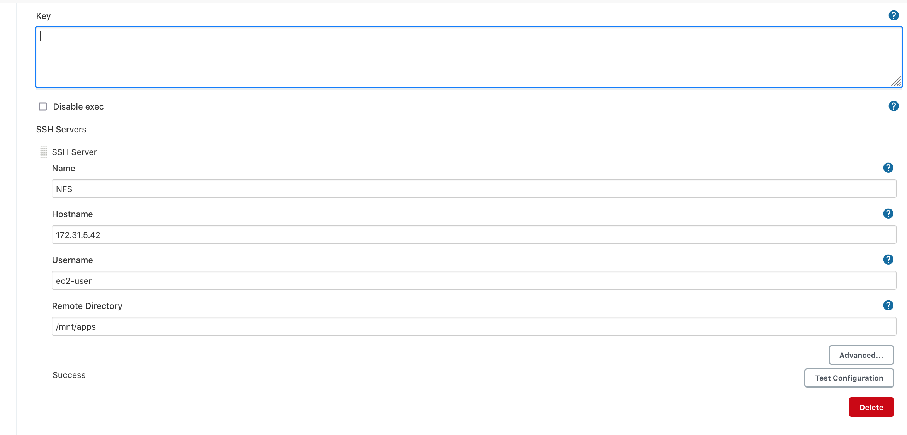

- Hostname: Private IP address of our NFS server.

- Username: ec2-user because our NFS server is based on RHEL.

    Remote directory: /mnt/apps because our 2 web servers will use it as a mounting point to retrieve files from the NFS server.

Now, in order to add the private key of the NFS server to your Jenkins server, first you need to open a new terminal tab. Then you need to change directories to where you have the private key that you used to SSH into your NFS server. In my case it is located on my "Documents" folder so:

`cd Documents`

Then you need to run:

`cat <private-key-name>.pem`

Now we paste the private under "Key": (I will not be providing mine here for security reasons)

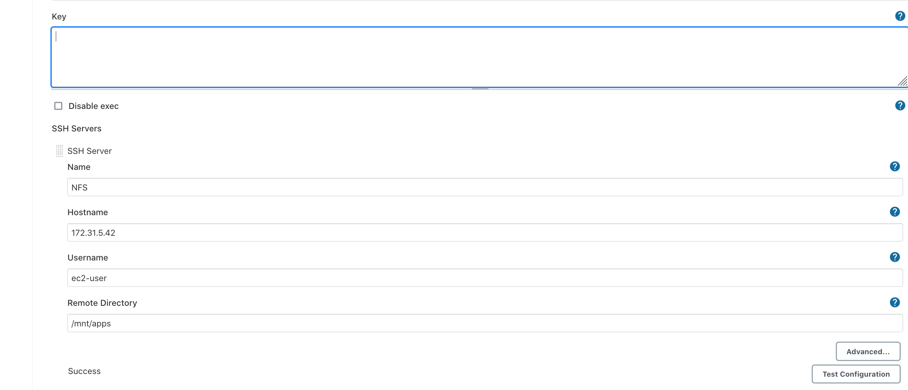

We test the configuration and make sure the connection returns "Success". Then we save the configuration.

- **NOTE**: *Keep in mind that TCP port 22 on the NFS server must be open to receive SSH connections.*

 - Now we open our Jenkins project configuration page and add another "Post-build Action" which is called "Send artifacts over SSH."

- Then we configure the Post-build Action to send all of the files produced by our build to our previously defined remote directory which is /mnt/apps. To do so, we type ** under 'Source files':

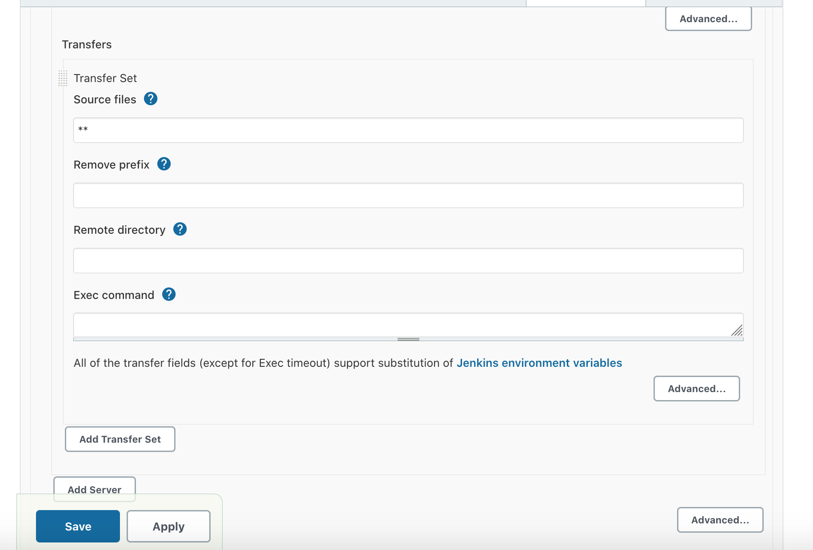

- We save this configuration. Now, you need to make a change in your README.md file located on your "GitHub Tooling" repository.

When you do so, the webhook will trigger a new job and in the "Console Output" of your Jenkins project you will find something similar to this on the last two lines:

    SSH: Transferred 25 file(s)`

    Finished: SUCCESS`

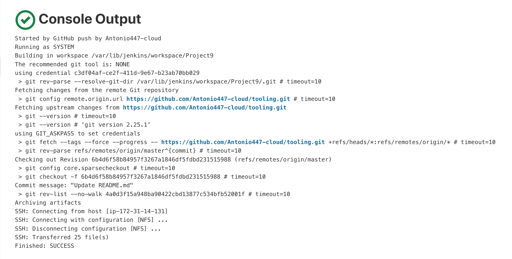

To make sure that the files in /mnt/apps have been updated. Once we do so, we SSH into our NFS server and check our README.md file:

`cat /mnt/apps/README.md`

We can see the change that we previously made in our GitHub on the last line "Checking Jenkins". This means that the automation job works as expected!

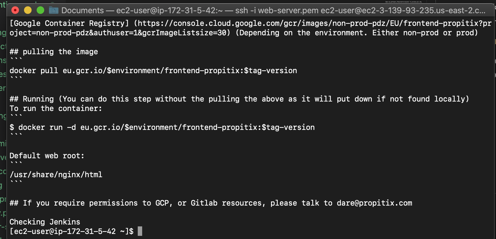

Congrats!! You have just added a Jenkins server to your previous set up on project: "load-balancer-solution-with-apache-step2" and configured a job to automatically deploy source code changes from your GitHub repository to your NFS and Jenkins server!